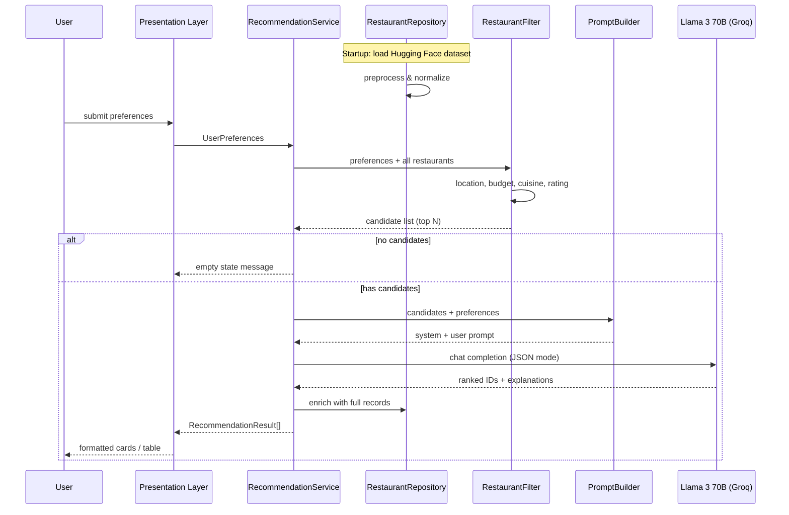

# Architecture: AI-Powered Restaurant Recommendation System

> Derived from [context.md](./context.md) — Zomato-inspired recommendation service combining structured restaurant data with LLM reasoning.

---

## 1. Architecture Overview

The system follows a **layered pipeline architecture**: ingest and normalize restaurant data once, accept user prefeVrences at runtime, filter candidates deterministically, then delegate ranking and explanation to **Llama 3 70B** (via Groq API). This split keeps costs predictable (the LLM sees only a shortlist), improves latency, and grounds AI output in real dataset fields.

```
┌─────────────────────────────────────────────────────────────────────────┐
│                           PRESENTATION LAYER                            │
│              Web UI (Streamlit / React) or CLI                          │
│   Collects: location, budget, cuisine, min rating, extras             │
│   Displays: ranked list + name, cuisine, rating, cost, explanation      │
└─────────────────────────────────┬───────────────────────────────────────┘
                                  │ HTTP / in-process calls
┌─────────────────────────────────▼───────────────────────────────────────┐
│                         APPLICATION LAYER                               │
│  RecommendationService                                                  │
│    ├── PreferenceValidator                                              │
│    ├── RestaurantFilter                                                 │
│    ├── PromptBuilder                                                    │
│    └── LLMRecommendationEngine                                          │
└───────────────┬─────────────────────────────┬───────────────────────────┘
                │                             │
┌───────────────▼──────────────┐   ┌──────────▼──────────────────────────┐
│         DATA LAYER           │   │         EXTERNAL SERVICES           │
│  RestaurantRepository        │   │  Llama 3 70B via Groq API           │
│  (in-memory / CSV / Parquet) │   │  (Groq — OpenAI-compatible)         │
│  Loaded from Hugging Face    │   │                                     │
└──────────────────────────────┘   └─────────────────────────────────────┘
```

### Design Principles

| Principle | Rationale |
|-----------|-----------|
| **Filter before LLM** | Reduces token usage and hallucination risk by sending only matching restaurants |
| **Structured I/O** | LLM returns JSON (ranked IDs + explanations) for reliable parsing |
| **Single source of truth** | All displayed fields come from the dataset; LLM explains, not invents metadata |
| **Fail gracefully** | Empty filter results → user message; LLM failure → fallback to rating-sorted list |
| **Separation of concerns** | Data loading, filtering, prompting, and UI are independent modules |

---

## 2. High-Level Data Flow



---

## 3. Component Architecture

### 3.1 Data Ingestion Module

**Responsibility:** One-time (or cached) load of the Zomato dataset from Hugging Face and transformation into a canonical internal schema.

| Step | Action |
|------|--------|
| Load | `datasets.load_dataset("ManikaSaini/zomato-restaurant-recommendation")` |
| Extract | Map raw columns → `Restaurant` model (see §5) |
| Normalize | Trim strings, parse ratings, map cost to budget tier |
| Persist (optional) | Save as `data/restaurants.parquet` for faster cold starts |
| Index | Build lookup by `id`; optional indexes on `location`, `cuisine` |

**Budget tier mapping (example):**

| Raw cost (approx.) | Tier |
|--------------------|------|
| ≤ 300 (or dataset-specific) | `low` |
| 301 – 700 | `medium` |
| > 700 | `high` |

Exact thresholds should be calibrated from dataset distribution during preprocessing.

### 3.2 User Input Module (Presentation Layer)

**Responsibility:** Capture and validate preferences before invoking the recommendation pipeline.

**Input schema:**

```python
UserPreferences:
  location: str              # required, e.g. "Bangalore"
  budget: Literal["low", "medium", "high"]  # required
  cuisine: str | None        # optional filter, e.g. "Italian"
  min_rating: float          # default 0.0, range 0–5
  additional_preferences: str | None  # free text, e.g. "family-friendly"
  top_k: int                 # default 5, max recommendations
```

**Validation rules:**

- `location` non-empty; fuzzy match against known cities in dataset
- `min_rating` in [0, 5]
- `budget` must be one of three enum values
- Sanitize free-text fields (length cap, strip HTML)

**UI options (pick one for MVP):**

| Option | Pros | Cons |
|--------|------|------|
| **Streamlit** | Fast to build, Python-native | Less customizable |
| **FastAPI + React** | Production-ready, API-first | More setup |
| **CLI** | Simplest for demos / tests | No visual polish |

Recommended MVP: **Streamlit** front-end calling a **Python service layer** directly (monolith); evolve to FastAPI if API consumers are needed.

### 3.3 Integration Layer

**Responsibility:** Bridge filtered structured data and the LLM via a well-designed prompt and response contract.

#### 3.3.1 RestaurantFilter

Deterministic filtering pipeline (order matters for performance):

1. **Location** — case-insensitive match on city/location field
2. **Minimum rating** — `rating >= min_rating`
3. **Cuisine** — substring or token match if cuisine specified
4. **Budget** — map `approx_cost(for two people)` → tier; keep matching tier
5. **Cap** — if results > `MAX_CANDIDATES` (e.g. 20), sort by rating desc and truncate

Output: `list[Restaurant]` passed to prompt builder.

#### 3.3.2 PromptBuilder

Constructs two-part prompt:

- **System message:** Role, constraints (only recommend from provided list, output JSON, no fabricated restaurants)
- **User message:** Serialized preferences + compact restaurant table (id, name, cuisine, rating, cost, location)

**Prompt design goals:**

- Include explicit ranking criteria (match to budget, cuisine, rating, additional preferences)
- Request per-restaurant `explanation` (1–2 sentences)
- Optional `summary` field for overall recommendation narrative
- Enforce JSON schema for parsing

### 3.4 Recommendation Engine (Groq)

**Responsibility:** Rank candidates and generate natural-language explanations using **Llama 3 70B** (accessed via the [Groq API](https://console.groq.com/docs/models)).

```
Input:  UserPreferences + list[Restaurant] (≤ 20 items)
Output: LLMRecommendationResponse
          summary: str | None
          recommendations: [{ restaurant_id, rank, explanation }]
```

**LLM:** This project uses **Llama 3 70B** via Groq exclusively (`model: llama3-70b-8192`). The Groq endpoint is OpenAI-compatible, so the official `openai` Python SDK can be used with a custom `base_url`.

**LLM client abstraction:**

```python
class LLMClient(Protocol):
    def complete(self, system: str, user: str) -> str: ...
```

Implementation: `GroqClient` — wraps the Groq chat completions API for Llama 3 70B.

```python
from openai import OpenAI

client = OpenAI(
    api_key=os.environ["GROQ_API_KEY"],
    base_url="https://api.groq.com/openai/v1",
)
response = client.chat.completions.create(
    model="llama3-70b-8192",
    messages=[
        {"role": "system", "content": system_prompt},
        {"role": "user", "content": user_prompt},
    ],
    temperature=0.3,
    max_tokens=4096,
)
```

**Configuration:**

| Env var | Purpose |
|---------|---------|
| `GROQ_API_KEY` | Groq API key for Llama 3 70B |
| `LLM_MODEL` | Default: `llama3-70b-8192` |
| `LLM_BASE_URL` | Default: `https://api.groq.com/openai/v1` |
| `LLM_TEMPERATURE` | Low (0.2–0.4) for consistent ranking |
| `MAX_CANDIDATES` | Max restaurants sent to the LLM |

**Post-processing:**

1. Parse JSON response (with retry on malformed output)
2. Validate all `restaurant_id` values exist in candidate set
3. Merge LLM output with `Restaurant` records for display fields
4. **Fallback:** if LLM fails, return top `top_k` by rating with generic explanation

### 3.5 Output Display Module

**Responsibility:** Render `RecommendationResult` objects for the user.

Each result card/row includes:

| Field | Source |
|-------|--------|
| Restaurant Name | Dataset |
| Cuisine | Dataset |
| Rating | Dataset |
| Estimated Cost | Dataset (formatted, e.g. "₹500 for two") |
| AI Explanation | LLM |
| Rank | LLM |

Optional UI enhancements: loading spinner during LLM call, empty-state when no matches, error banner on fallback mode.

---

## 4. Recommended Project Structure

```
zomato-milestone/
├── context.md
├── architecture.md
├── README.md
├── requirements.txt
├── .env.example
├── data/                          # gitignored cached dataset
│   └── restaurants.parquet
├── src/
│   ├── __init__.py
│   ├── main.py                    # Streamlit or FastAPI entrypoint
│   ├── config.py                  # settings from env
│   ├── models/
│   │   ├── restaurant.py          # Restaurant dataclass
│   │   ├── preferences.py         # UserPreferences
│   │   └── recommendation.py      # RecommendationResult, LLM response
│   ├── data/
│   │   ├── loader.py              # Hugging Face load + preprocess
│   │   └── repository.py          # in-memory access + lookup
│   ├── services/
│   │   ├── filter.py              # RestaurantFilter
│   │   ├── prompt_builder.py      # PromptBuilder
│   │   ├── recommendation.py      # RecommendationService (orchestrator)
│   │   └── llm/
│   │       ├── base.py            # LLMClient protocol
│   │       └── groq_client.py     # Llama 3 70B via Groq API
│   └── ui/
│       └── streamlit_app.py       # forms + results (if Streamlit)
└── tests/
    ├── test_filter.py
    ├── test_prompt_builder.py
    └── test_recommendation.py
```

---

## 5. Data Models

### Restaurant (internal canonical schema)

```python
@dataclass
class Restaurant:
    id: str
    name: str
    location: str           # city / locality
    cuisine: str            # may be comma-separated
    rating: float           # 0.0 – 5.0
    cost_for_two: int       # numeric, local currency
    budget_tier: str        # low | medium | high (derived)
    address: str | None = None
    votes: int | None = None
```

Field names should be mapped from actual Hugging Face column names during `loader.py` implementation.

### UserPreferences

See §3.2.

### RecommendationResult (API / UI response)

```python
@dataclass
class RecommendationResult:
    rank: int
    restaurant: Restaurant
    explanation: str
```

### LLM JSON response contract

```json
{
  "summary": "Based on your preference for Italian food in Bangalore with a medium budget...",
  "recommendations": [
    {
      "restaurant_id": "abc123",
      "rank": 1,
      "explanation": "Highly rated Italian spot within your budget, known for family-friendly ambiance."
    }
  ]
}
```

---

## 6. API Design (Optional — FastAPI variant)

If exposing a REST API instead of (or in addition to) Streamlit:

| Method | Endpoint | Description |
|--------|----------|-------------|
| `GET` | `/health` | Liveness check |
| `GET` | `/locations` | Distinct cities for UI dropdown |
| `GET` | `/cuisines` | Distinct cuisines for autocomplete |
| `POST` | `/recommendations` | Body: `UserPreferences` → `list[RecommendationResult]` |

**Example request:**

```json
POST /recommendations
{
  "location": "Bangalore",
  "budget": "medium",
  "cuisine": "Italian",
  "min_rating": 4.0,
  "additional_preferences": "family-friendly, quick service",
  "top_k": 5
}
```

**Example response:**

```json
{
  "summary": "...",
  "recommendations": [
    {
      "rank": 1,
      "restaurant": {
        "name": "Example Bistro",
        "cuisine": "Italian",
        "rating": 4.5,
        "cost_for_two": 600
      },
      "explanation": "..."
    }
  ],
  "fallback_used": false
}
```

---

## 7. Prompt Engineering Strategy

### System prompt (template)

```
You are a restaurant recommendation assistant for a Zomato-like app.
You will receive a user's preferences and a numbered list of real restaurants from our database.
Rules:
- ONLY recommend restaurants from the provided list (use restaurant_id).
- Rank by best fit: location match, budget tier, cuisine, rating, and additional preferences.
- Write concise, friendly explanations (1-2 sentences each).
- Respond with valid JSON matching the required schema. No markdown fences.
```

### User prompt (template)

```
User preferences:
- Location: {location}
- Budget: {budget}
- Cuisine: {cuisine or "any"}
- Minimum rating: {min_rating}
- Additional: {additional_preferences or "none"}

Restaurants (JSON array):
{compact_restaurant_json}

Return top {top_k} recommendations ranked best to worst.
```

### Quality safeguards

- Low temperature for reproducible rankings
- JSON mode / structured output via Groq prompt constraints (explicit schema in system message)
- Retry once with "fix your JSON" on parse failure
- Reject LLM IDs not in candidate set

---

## 8. Non-Functional Requirements

| Concern | Target | Approach |
|---------|--------|----------|
| **Latency** | < 5s end-to-end (excl. first dataset load) | Cap candidates at 20; cache dataset locally |
| **Cost** | Minimal LLM tokens | Filter first; compact JSON in prompt |
| **Reliability** | Usable without LLM | Rating-based fallback sort |
| **Accuracy** | No fake restaurants | Strict ID validation; display only dataset fields |
| **Security** | No secrets in repo | `.env` for `GROQ_API_KEY`; `.env.example` documented |
| **Testability** | Unit-test filter & prompt | Mock `LLMClient` in integration tests |

---

## 9. Deployment Architecture

### Local development

```
Developer machine
  ├── Python 3.10+
  ├── venv + requirements.txt
  ├── .env (GROQ_API_KEY)
  └── streamlit run src/ui/streamlit_app.py
```

### Production (optional evolution)

```
                    ┌──────────────┐
                    │   CDN /      │
                    │   Static UI  │
                    └──────┬───────┘
                           │
                    ┌──────▼───────┐
                    │  FastAPI     │
                    │  (container) │
                    └──────┬───────┘
                           │
              ┌────────────┼────────────┐
              │            │            │
       ┌──────▼──────┐ ┌───▼───┐ ┌─────▼─────┐
       │ Parquet /   │ │ Redis │ │ Llama 3   │
       │ volume mount│ │ cache │ │ Groq API  │
       └─────────────┘ └───────┘ └───────────┘
```

MVP does not require Redis or containers; a single Python process with cached Parquet is sufficient.

---

## 10. Error Handling & Edge Cases

| Scenario | Behavior |
|----------|----------|
| Unknown location | Suggest closest matches from dataset cities; or return validation error |
| Zero filter matches | UI message: "No restaurants match your criteria. Try relaxing filters." |
| LLM timeout / error | Log error; return rating-sorted fallback with `fallback_used: true` (Groq API unavailable) |
| Malformed LLM JSON | One retry; then fallback |
| Dataset load failure | Fail fast at startup with clear error |
| Very long `additional_preferences` | Truncate to 500 chars before prompt |

---

## 11. Testing Strategy

| Layer | Test focus |
|-------|------------|
| `loader.py` | Column mapping, budget tier derivation, no null IDs |
| `filter.py` | Each filter dimension; empty result; cap behavior |
| `prompt_builder.py` | Prompt contains all preferences; restaurant count |
| `recommendation.py` | End-to-end with mock `GroqClient`; fallback path |
| UI | Manual / smoke test for form validation and display |

---

## 12. Implementation Phases

| Phase | Deliverable |
|-------|-------------|
| **Phase 1** | Data loader + repository + filter (no LLM) — rating-sorted results |
| **Phase 2** | Groq client (`groq_client.py`) + prompt builder + JSON parsing |
| **Phase 3** | Streamlit UI wired to `RecommendationService` |
| **Phase 4** | Error handling, fallback, caching, tests |
| **Phase 5** (optional) | FastAPI REST layer, deployment |

---

## 13. Technology Stack Summary

| Layer | Recommended choice |
|-------|-------------------|
| Language | Python 3.10+ |
| Dataset | `datasets` (Hugging Face) |
| Data processing | `pandas` |
| LLM | **Llama 3 70B** via [Groq API](https://console.groq.com/docs/models) (`llama3-70b-8192`, OpenAI-compatible SDK) |
| Web UI (MVP) | Streamlit |
| API (optional) | FastAPI + Uvicorn |
| Config | `pydantic-settings` + `.env` |
| Testing | `pytest` |

---

## 14. Mapping to Context Requirements

| Context requirement | Architecture element |
|---------------------|---------------------|
| Hugging Face dataset | `data/loader.py` + `RestaurantRepository` |
| User preferences input | `UserPreferences` + Presentation Layer |
| Filter before LLM | `RestaurantFilter` in Integration Layer |
| LLM rank + explain | `LLMRecommendationEngine` + `PromptBuilder` + **Llama 3 70B** (`groq_client.py`) |
| Display name, cuisine, rating, cost, explanation | `RecommendationResult` + UI cards |
| Success criteria (§ context.md) | Full pipeline §2 data flow + Phase 1–3 |

---

*Document version: 1.2 — LLM: Llama 3 70B (Groq). Aligned with [context.md](./context.md)*
