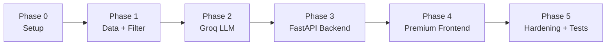

# Phase-Wise Implementation Plan

> AI-Powered Restaurant Recommendation System (Zomato Use Case)  
> Derived from [context.md](./context.md) and [architecture.md](./architecture.md)

---

## Executive Summary

This plan breaks implementation into **5 phases**, from project scaffolding through optional production API. Phases 1–4 deliver the full MVP (data pipeline, filtering, Groq-powered recommendations, Streamlit UI, tests). Phase 5 is optional for REST API and deployment.

| Phase | Focus | Outcome |
|-------|--------|---------|
| **0** | Project setup | Runnable repo skeleton, dependencies, config |
| **1** | Data layer + filter | Dataset loaded; rating-sorted results without LLM |
| **2** | Groq integration | AI ranking and explanations via Groq API (Llama 3 70B) |
| **3** | Backend API | FastAPI REST layer replacing Streamlit MVP |
| **4** | Premium Frontend | High-quality, modern web frontend (Vite/React) with rich aesthetics |
| **5** | Hardening + tests | Fallbacks, caching, edge cases, pytest coverage |

**LLM:** Llama 3 70B (`llama3-70b-8192`) via [Groq API](https://console.groq.com/docs/models) — per architecture.

---

## Prerequisites

Before Phase 0:

- Python 3.10+ installed
- Git (optional)
- Groq API key (required from Phase 2 onward)
- Internet access for Hugging Face dataset download

---

## Phase 0: Project Setup & Foundation

**Goal:** Establish project structure, dependencies, and configuration so later phases have a consistent foundation.

**Maps to context:** Enables all workflow stages; no user-facing feature yet.

### Tasks

| # | Task | File(s) |
|---|------|---------|
| 0.1 | Create directory structure per architecture §4 | `src/`, `src/models/`, `src/data/`, `src/services/`, `src/services/llm/`, `src/ui/`, `tests/`, `data/` |
| 0.2 | Add `requirements.txt` | `datasets`, `pandas`, `pyarrow`, `streamlit`, `openai`, `pydantic`, `pydantic-settings`, `python-dotenv`, `pytest` |
| 0.3 | Create `.env.example` with `GROQ_API_KEY`, `LLM_MODEL`, `LLM_BASE_URL`, `LLM_TEMPERATURE`, `MAX_CANDIDATES` | `.env.example` |
| 0.4 | Implement `config.py` using `pydantic-settings` | `src/config.py` |
| 0.5 | Add `.gitignore` (`data/`, `.env`, `__pycache__/`, `.venv/`) | `.gitignore` |
| 0.6 | Write minimal `README.md` with setup and run instructions | `README.md` |

### Deliverables

- [ ] Virtual environment created and dependencies installed
- [ ] `src/config.py` loads settings from environment with documented defaults
- [ ] Project imports cleanly (`python -c "import src"`)

### Acceptance Criteria

- `pip install -r requirements.txt` succeeds
- Config reads `GROQ_API_KEY` without crashing when unset (warn only until Phase 2)
- Folder layout matches architecture §4

### Estimated effort

**0.5–1 day**

---

## Phase 1: Data Ingestion, Models & Filtering

**Goal:** Load the Zomato Hugging Face dataset, normalize it, and filter restaurants by user preferences. Return **rating-sorted** results without calling the LLM.

**Maps to context:**

- § Workflow 1 — Data Ingestion
- § Workflow 3 (partial) — Filter based on user input
- Success criteria #1–2 (preferences + filtering)

### Tasks

#### 1.1 Data models

| # | Task | File(s) |
|---|------|---------|
| 1.1.1 | Define `Restaurant` dataclass | `src/models/restaurant.py` |
| 1.1.2 | Define `UserPreferences` with validation | `src/models/preferences.py` |
| 1.1.3 | Define `RecommendationResult` (rank, restaurant, explanation) | `src/models/recommendation.py` |

**`UserPreferences` fields:** `location`, `budget` (`low` \| `medium` \| `high`), `cuisine` (optional), `min_rating`, `additional_preferences` (optional), `top_k` (default 5).

#### 1.2 Data loader

| # | Task | File(s) |
|---|------|---------|
| 1.2.1 | Load dataset `ManikaSaini/zomato-restaurant-recommendation` | `src/data/loader.py` |
| 1.2.2 | Map raw columns → `Restaurant` (inspect dataset schema first) | `src/data/loader.py` |
| 1.2.3 | Normalize: trim strings, parse ratings, handle missing values | `src/data/loader.py` |
| 1.2.4 | Derive `budget_tier` from cost (calibrate thresholds from distribution) | `src/data/loader.py` |
| 1.2.5 | Assign stable `id` per row if not present | `src/data/loader.py` |
| 1.2.6 | Optionally cache to `data/restaurants.parquet` | `src/data/loader.py` |

**Budget tier (initial — refine after inspecting data):**

| Cost for two | Tier |
|--------------|------|
| ≤ 300 | `low` |
| 301 – 700 | `medium` |
| > 700 | `high` |

#### 1.3 Repository

| # | Task | File(s) |
|---|------|---------|
| 1.3.1 | `RestaurantRepository`: load all, get by id, distinct locations/cuisines | `src/data/repository.py` |
| 1.3.2 | Singleton or cached load at startup | `src/data/repository.py` |

#### 1.4 Filter service

| # | Task | File(s) |
|---|------|---------|
| 1.4.1 | Implement `RestaurantFilter` pipeline (location → rating → cuisine → budget → cap) | `src/services/filter.py` |
| 1.4.2 | Cap results at `MAX_CANDIDATES` (default 20), sort by rating desc | `src/services/filter.py` |
| 1.4.3 | `PreferenceValidator`: validate location against known cities, rating range, budget enum | `src/services/validator.py` or inline in filter |

#### 1.5 Minimal orchestrator (no LLM)

| # | Task | File(s) |
|---|------|---------|
| 1.5.1 | `RecommendationService.recommend()` — filter + sort by rating + generic explanation placeholder | `src/services/recommendation.py` |

#### 1.6 Tests

| # | Task | File(s) |
|---|------|---------|
| 1.6.1 | Test loader: column mapping, budget tiers, no null IDs | `tests/test_loader.py` |
| 1.6.2 | Test filter: each dimension, empty results, cap behavior | `tests/test_filter.py` |

### Deliverables

- [ ] Dataset loads from Hugging Face (or cached Parquet)
- [ ] `RestaurantRepository` exposes restaurants and metadata lookups
- [ ] `RestaurantFilter` returns matching candidates for sample preferences
- [ ] `RecommendationService` returns top-k by rating with placeholder explanations
- [ ] Unit tests pass for loader and filter

### Acceptance Criteria

- Given `location=Bangalore`, `budget=medium`, `min_rating=4.0`, only matching restaurants returned
- Zero matches returns empty list (not an error)
- All displayed fields (name, cuisine, rating, cost) come from dataset records
- pytest passes for Phase 1 tests

### Manual verification

```python
# Quick smoke test (CLI or script)
from src.data.repository import RestaurantRepository
from src.models.preferences import UserPreferences
from src.services.recommendation import RecommendationService

repo = RestaurantRepository()
service = RecommendationService(repo)
prefs = UserPreferences(location="Bangalore", budget="medium", min_rating=4.0, top_k=5)
results = service.recommend(prefs)  # rating-sorted, no LLM yet
```

### Dependencies

- Phase 0 complete

### Estimated effort

**2–3 days**

---

## Phase 2: Groq Integration & Prompt Layer

**Goal:** Connect to Llama 3 70B via Groq API, build prompts, parse JSON responses, and rank restaurants with AI-generated explanations.

**Maps to context:**

- § Workflow 3 — Pass structured results into LLM prompt
- § Workflow 4 — Rank, explain, optionally summarize
- Success criteria #3 — LLM ranks and explains filtered data

### Tasks

#### 2.1 LLM client

| # | Task | File(s) |
|---|------|---------|
| 2.1.1 | Define `LLMClient` protocol | `src/services/llm/base.py` |
| 2.1.2 | Implement `GroqClient` using OpenAI SDK + Groq `base_url` | `src/services/llm/groq_client.py` |
| 2.1.3 | Use `model="llama3-70b-8192"`, configurable temperature (0.2–0.4) | `src/services/llm/groq_client.py` |

```python
# Reference implementation pattern (architecture §3.4)
client = OpenAI(api_key=settings.groq_api_key, base_url=settings.llm_base_url)
client.chat.completions.create(model="llama3-70b-8192", messages=[...], temperature=0.3)
```

#### 2.2 Prompt builder

| # | Task | File(s) |
|---|------|---------|
| 2.2.1 | System prompt: role, JSON-only output, no fabricated restaurants | `src/services/prompt_builder.py` |
| 2.2.2 | User prompt: preferences + compact restaurant JSON array | `src/services/prompt_builder.py` |
| 2.2.3 | Truncate `additional_preferences` to 500 chars | `src/services/prompt_builder.py` |
| 2.2.4 | Include JSON schema in system message | `src/services/prompt_builder.py` |

**Expected LLM response schema:**

```json
{
  "summary": "optional overall narrative",
  "recommendations": [
    { "restaurant_id": "...", "rank": 1, "explanation": "..." }
  ]
}
```

#### 2.3 Response parsing & validation

| # | Task | File(s) |
|---|------|---------|
| 2.3.1 | Parse JSON from LLM response (strip markdown fences if present) | `src/services/recommendation.py` |
| 2.3.2 | Validate `restaurant_id` values exist in candidate set | `src/services/recommendation.py` |
| 2.3.3 | Merge LLM output with `Restaurant` records → `RecommendationResult[]` | `src/services/recommendation.py` |
| 2.3.4 | Retry once on malformed JSON with repair prompt | `src/services/recommendation.py` |

#### 2.4 Update orchestrator

| # | Task | File(s) |
|---|------|---------|
| 2.4.1 | Wire `PromptBuilder` + `GroqClient` into `RecommendationService` | `src/services/recommendation.py` |
| 2.4.2 | Return `summary` alongside recommendations | `src/services/recommendation.py` |

#### 2.5 Tests

| # | Task | File(s) |
|---|------|---------|
| 2.5.1 | Test prompt contains all preference fields and restaurant count | `tests/test_prompt_builder.py` |
| 2.5.2 | Test recommendation flow with **mock** `GroqClient` | `tests/test_recommendation.py` |
| 2.5.3 | Optional: one integration test against live API (skipped in CI) | `tests/test_groq_integration.py` |

### Deliverables

- [ ] `GroqClient` successfully calls Groq API with `llama3-70b-8192`
- [ ] `PromptBuilder` produces system + user messages per architecture §7
- [ ] `RecommendationService` returns ranked results with AI explanations
- [ ] Invalid LLM IDs rejected; JSON parse retry implemented
- [ ] Tests pass with mocked LLM

### Acceptance Criteria

- Live call to Groq (Llama 3 70B) returns valid JSON for a sample preference set
- Explanations reference user preferences (budget, cuisine, etc.)
- Restaurant metadata in output matches dataset (not LLM-invented)
- Mocked tests run without API key

### Dependencies

- Phase 1 complete
- `GROQ_API_KEY` set in `.env`

### Estimated effort

**2–3 days**

---

## Phase 3: Backend REST API (FastAPI)

**Goal:** Expose the recommendation engine as a robust REST API for the new frontend.

**Maps to context:**
- § Workflow 5 — API Output
- Success criteria #1 and #4 — System accessibility

### Tasks

#### 3.1 FastAPI application

| # | Task | File(s) |
|---|------|---------|
| 3.1.1 | GET /health — liveness | src/api/main.py |
| 3.1.2 | GET /locations — distinct cities | src/api/main.py |
| 3.1.3 | GET /cuisines — distinct cuisines | src/api/main.py |
| 3.1.4 | POST /recommendations — body: UserPreferences | src/api/main.py |
| 3.1.5 | Wire RecommendationService into endpoints | src/api/main.py |

#### 3.2 API models

| # | Task | File(s) |
|---|------|---------|
| 3.2.1 | Pydantic request/response models | src/api/schemas.py |

### Deliverables
- [ ] FastAPI REST API runs locally on port 8000
- [ ] Swagger UI available at /docs
- [ ] Endpoints handle recommendations and metadata lookups

### Estimated effort
**1-2 days**

---

## Phase 4: High-Quality Frontend Web App

**Goal:** Build a stunning, premium web interface to consume the FastAPI backend.

**Maps to context:**
- UI modernization and WOW factor.
- Premium Design Aesthetics.

### Tasks

#### 4.1 Scaffold & Setup

| # | Task | File(s) |
|---|------|---------|
| 4.1.1 | Initialize frontend (Vite + React or Vanilla JS) | rontend/ |
| 4.1.2 | Setup routing and API clients | rontend/src/api/ |

#### 4.2 Premium Design Implementation

| # | Task | File(s) |
|---|------|---------|
| 4.2.1 | Implement rich aesthetics (dark mode, glassmorphism, dynamic animations) | rontend/src/styles/ |
| 4.2.2 | Form components for Location, Budget, Cuisine, Rating | rontend/src/components/ |
| 4.2.3 | Result cards with hover effects and micro-animations | rontend/src/components/ |

### Deliverables
- [ ] Modern, visually striking web frontend running locally
- [ ] Full end-to-end integration with the FastAPI backend
- [ ] Premium user experience that exceeds the MVP Streamlit app

### Estimated effort
**2-3 days**

---

## Phase 5: Hardening, Fallbacks, Caching & Tests

---

## Phase Dependency Graph



---

## Milestone Checklist (MVP = Phases 0–4)

Use this before considering the project complete:

| # | Requirement (from context.md) | Phase | Status |
|---|------------------------------|-------|--------|
| 1 | User can specify location, budget, cuisine, min rating, extra preferences | 3 | ☐ |
| 2 | System filters dataset based on inputs | 1 | ☐ |
| 3 | Groq (Llama 3 70B) ranks and explains using filtered data | 2 | ☐ |
| 4 | Results show name, cuisine, rating, cost, AI explanation | 3 | ☐ |
| 5 | Hugging Face dataset loaded and preprocessed | 1 | ☐ |
| 6 | Filter-before-LLM pattern enforced | 1, 2 | ☐ |
| 7 | Graceful fallback when Groq API fails | 4 | ☐ |
| 8 | Unit tests pass | 1, 2, 4 | ☐ |

---

## File Creation Order (Quick Reference)

```
Phase 0:  .gitignore, requirements.txt, .env.example, src/config.py, README.md
Phase 1:  src/models/*.py, src/data/loader.py, src/data/repository.py,
          src/services/filter.py, src/services/recommendation.py, tests/test_*.py
Phase 2:  src/services/llm/base.py, src/services/llm/groq_client.py,
          src/services/prompt_builder.py, tests/test_prompt_builder.py
Phase 3:  src/ui/streamlit_app.py
Phase 4:  fallback logic, caching, logging, test completion, README updates
Phase 5:  src/api/main.py, src/api/schemas.py, Dockerfile, tests/test_api.py
```

---

## Risk Register

| Risk | Impact | Mitigation | Phase |
|------|--------|------------|-------|
| Hugging Face column names differ from assumptions | Loader breaks | Inspect schema first; map explicitly | 1 |
| Groq returns non-JSON | Parse failures | Retry prompt; fallback to rating sort | 2, 4 |
| Groq API rate limits / downtime | No AI explanations | Fallback mode; mock for tests | 2, 4 |
| Large dataset slow on first load | Poor UX | Parquet cache; `@st.cache_resource` | 1, 3, 4 |
| LLM invents restaurant names | Wrong data shown | Validate IDs; display only dataset fields | 2, 4 |
| Budget tier thresholds wrong for dataset | Bad filters | Calibrate from cost distribution | 1 |

---

## Timeline Estimate (Total)

| Scope | Duration |
|-------|----------|
| MVP (Phases 0–4) | **8–11 days** |
| With Phase 5 (API + deploy) | **10–14 days** |

*Assumes one developer working full-time; adjust for part-time or pair programming.*

---

## Suggested Daily Breakdown (MVP)

| Day | Focus |
|-----|--------|
| 1 | Phase 0 + start Phase 1 models & loader |
| 2 | Phase 1 repository, filter, tests |
| 3 | Phase 1 orchestrator + Phase 2 Groq client |
| 4 | Phase 2 prompt builder, parsing, recommendation wiring |
| 5 | Phase 2 tests + Phase 3 Streamlit UI |
| 6 | Phase 3 polish + Phase 4 fallback & caching |
| 7 | Phase 4 tests, README, end-to-end demo rehearsal |

---

## References

- [context.md](./context.md) — product requirements and success criteria
- [architecture.md](./architecture.md) — system design, Groq integration, data models
- [Zomato dataset](https://huggingface.co/datasets/ManikaSaini/zomato-restaurant-recommendation)
- [Groq API docs](https://console.groq.com/docs/models)

---

*Document version: 1.1 — aligned with architecture.md v1.2 (Groq / Llama 3 70B) and context.md*
